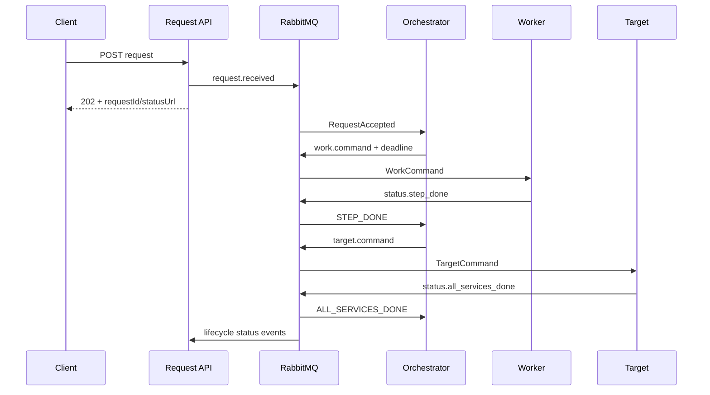
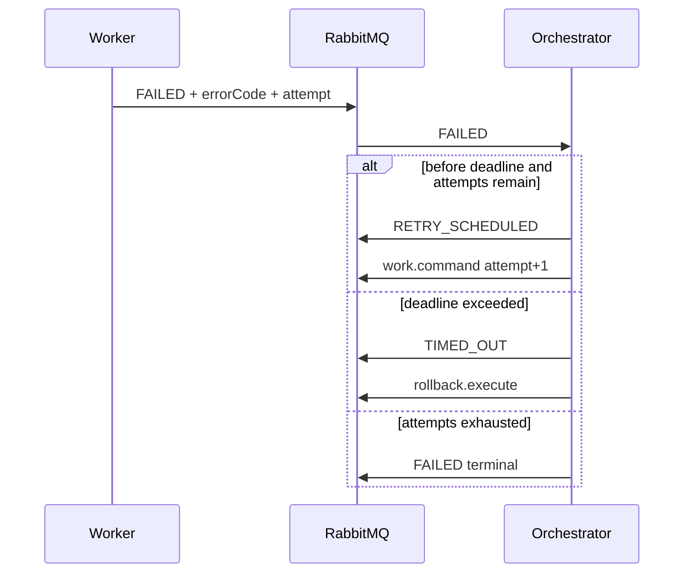
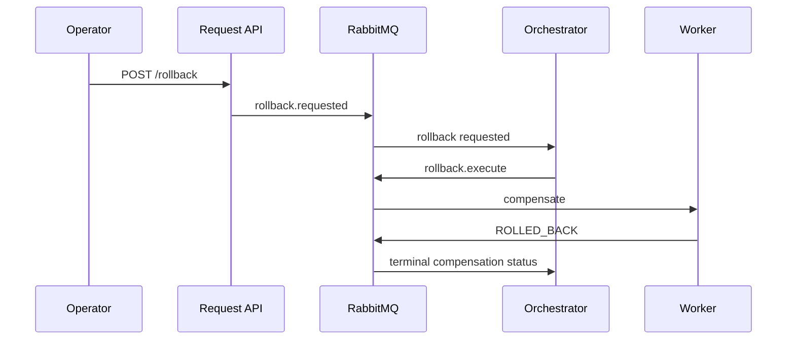

# Sequences

## Happy path

```mermaid
sequenceDiagram
 Client->>Request API: POST request
 Request API->>RabbitMQ: request.received
 Request API-->>Client: 202 + requestId/statusUrl
 RabbitMQ->>Orchestrator: RequestAccepted
 Orchestrator->>RabbitMQ: work.command + deadline
 RabbitMQ->>Worker: WorkCommand
 Worker->>RabbitMQ: status.step_done
 RabbitMQ->>Orchestrator: STEP_DONE
 Orchestrator->>RabbitMQ: target.command
 RabbitMQ->>Target: TargetCommand
 Target->>RabbitMQ: status.all_services_done
 RabbitMQ->>Orchestrator: ALL_SERVICES_DONE
 RabbitMQ->>Request API: lifecycle status events
```

## Retry and deadline

```mermaid
sequenceDiagram
 Worker->>RabbitMQ: FAILED + errorCode + attempt
 RabbitMQ->>Orchestrator: FAILED
 alt before deadline and attempts remain
  Orchestrator->>RabbitMQ: RETRY_SCHEDULED
  Orchestrator->>RabbitMQ: work.command attempt+1
 else deadline exceeded
  Orchestrator->>RabbitMQ: TIMED_OUT
  Orchestrator->>RabbitMQ: rollback.execute
 else attempts exhausted
  Orchestrator->>RabbitMQ: FAILED terminal
 end
```

## Rollback

```mermaid
sequenceDiagram
 Operator->>Request API: POST /rollback
 Request API->>RabbitMQ: rollback.requested
 RabbitMQ->>Orchestrator: rollback requested
 Orchestrator->>RabbitMQ: rollback.execute
 RabbitMQ->>Worker: compensate
 Worker->>RabbitMQ: ROLLED_BACK
 RabbitMQ->>Orchestrator: terminal compensation status
```
